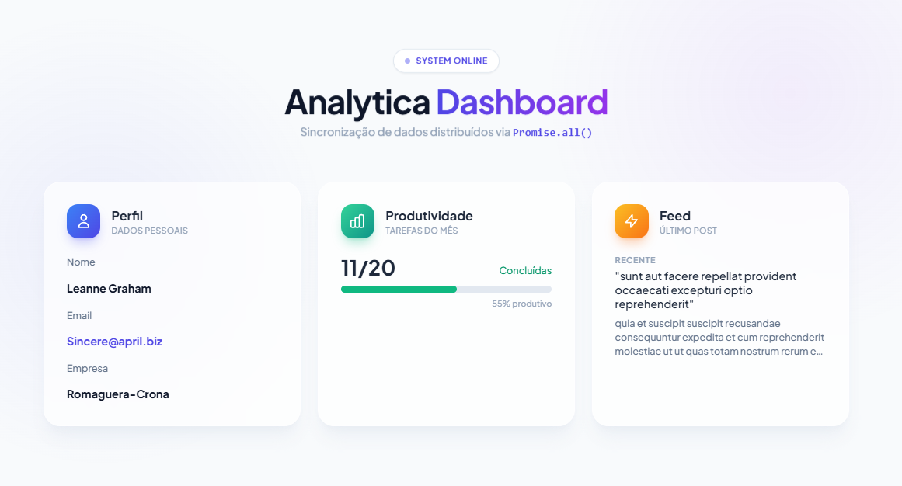

# 📊 Analytica Dashboard


## 📸 Preview




---

## 🚀 Sobre o Projeto

Este projeto foi desenvolvido como um desafio técnico focado em **assincronicidade** e **UX (User Experience)**. O objetivo principal foi criar uma interface que carrega dados de múltiplos endpoints simultaneamente, garantindo performance, e que trata falhas de rede de forma elegante, sem "quebrar" a aplicação para o usuário final.

### 🎯 Funcionalidades

- **Carregamento Paralelo:** Sincronização de 3 requisições API (Usuário, Tarefas, Posts) usando `Promise.all`.
- **UI Otimista & Loading:** Feedback visual imediato durante o fetching de dados.
- **Design Moderno:** Interface estilo "Glassmorphism" construída com Tailwind CSS.
---

## 🛠️ Tecnologias Utilizadas

- **HTML5 Semântico**: Estrutura da aplicação.
- **JavaScript (ES6+)**: Lógica de promises e manipulação do DOM.
- **Tailwind CSS**: Estilização via CDN para prototipagem rápida e UI moderna.
- **JSONPlaceholder**: API pública para simulação de dados reais.

---

## 🧠 Destaques Técnicos

### Estratégia de Promises

Para este dashboard, adotei uma abordagem híbrida de tratamento de promessas:

1.  **Caminho Feliz (`Promise.all`)**:
    Utilizei `Promise.all()` para disparar todas as requisições em paralelo. Se todas funcionarem, o usuário vê o dashboard completo instantaneamente.

    ```javascript
    const responses = await Promise.all(endpoints.map(url => fetch(url)));
    ```

2.  **Diagnóstico de Falha (`Promise.allSettled`)**:
    Se o `Promise.all` falha (rejeita), o fluxo entra no `catch`. Nesse momento, utilizo `Promise.allSettled()` para re-executar a verificação e identificar **qual** endpoint específico causou o erro, fornecendo uma mensagem amigável ao usuário (ex: "Falha ao carregar: Tarefas").

---

## 📂 Como Executar

Simples e direto, sem necessidade de instalação de dependências (Node/NPM), pois utilizamos Tailwind via CDN.

1. Clone o repositório:
```bash
git clone https://github.com/Alicia-Alexia/dashboard.git
   ```
2. Acesse a pasta do projeto no terminal/cmd
```bash
$ cd dashboard
# Abra o index.html no navegador
```

## 📂 Estrutura de Arquivos

A estrutura foi pensada para projetos estáticos, mantendo a raiz limpa e os recursos organizados:

/dashboard

    │
    ├── assets/              <-- Pasta principal de recursos
    │   ├── js/              <-- Pasta específica para Scripts
    │   │   └── script.js
    │   │
    │   │
    │   └── img/ 
    |        └── image.png     
    │
    ├── index.html           
    └── README.md         <-- Documentação


## 🤝 Autor
Desenvolvido por Alicia como parte de estudos em Frontend Development.